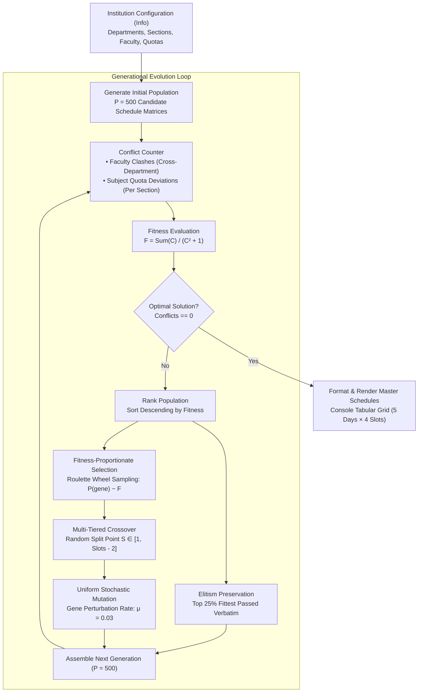

# Multi-Department Timetable Scheduling via Genetic Algorithms

[](https://www.python.org/)
[](https://en.wikipedia.org/wiki/Genetic_algorithm)
[-orange.svg)](https://en.wikipedia.org/wiki/Constraint_satisfaction_problem)
[-brightgreen.svg)](#requirements)
[](LICENSE)

An evolutionary optimization engine designed to solve the **NP-hard University Course Timetabling Constraint Satisfaction Problem (CSP)** across multi-department, multi-section academic institutions. Built entirely with vanilla Python standard libraries, the system resolves high-dimensional combinatorial conflicts between faculty availability, weekly subject credit quotas, and classroom slot allocations.

---

## Key Highlights

- **Multi-Department Coordination**: Simultaneously generates global master timetables across multiple engineering departments (e.g., Computer Science & Engineering, Electronics & Communication Engineering) and multiple cohort sections.
- **Strict Hard-Constraint Enforcement**: Guarantees zero simultaneous faculty double-booking across departments and enforces exact weekly lecture quotas per course.
- **Non-Linear Quadratic Fitness Formulation**: Implements a self-scaling penalty fitness model that sharply magnifies differentiation as candidate schedules approach zero conflicts.
- **Adaptive Genetic Operators**: Features 25% elitism preservation, fitness-proportionate (roulette wheel) selection, multi-tiered chromosomal crossover, and per-slot stochastic uniform mutation.
- **Zero External Dependencies**: Implemented natively in pure Python (`random` module only) with zero third-party package overhead.

---

## Evolutionary Scheduling Architecture

The scheduling engine represents the entire institutional timetable as a multi-dimensional chromosome matrix. The evolutionary search iteratively refines candidate schedules until an optimal, zero-conflict schedule is discovered.



---

## Mathematical Formulation

### 1. Chromosome Representation
Let the institutional timetable be modeled as a 3D schedule tensor:
$$T \in \mathcal{C}^{D \times S \times K}$$
where:
- $D$ is the number of academic departments.
- $S$ is the number of sections per department.
- $K = N_{\text{days}} \times N_{\text{slots\_per\_day}}$ is the total number of periods per week ($5 \times 4 = 20$).
- $\mathcal{C}$ is the set of valid course objects, including an auxiliary $\text{Break}$ entity for unallocated slots.

---

### 2. Hard Constraints & Penalty Metrics

The objective function minimizes total conflict count $C(T) = C_{\text{faculty}}(T) + C_{\text{quota}}(T)$:

#### A. Faculty Clash Invariance (Cross-Department No-Overlap)
A faculty instructor cannot instruct two different classes concurrently across any section or department in slot $k$:
$$C_{\text{faculty}}(T) = \sum_{k=0}^{K-1} \sum_{f \in \mathcal{F}} \max\left(0, \sum_{d=0}^{D-1} \sum_{s=0}^{S-1} \mathbb{I}(f \in \text{Faculty}(T[d, s, k])) - 1\right)$$
where $\mathcal{F}$ represents the institutional faculty set, and $\mathbb{I}$ is the indicator function.

#### B. Course Credit Quota Satisfaction
Each section must fulfill the exact weekly required lecture allocation $Q(c)$ for every assigned subject $c \in \mathcal{C}_{d, s}$:
$$C_{\text{quota}}(T) = \sum_{d=0}^{D-1} \sum_{s=0}^{S-1} \sum_{c \in \mathcal{C}_{d, s}} \left| \sum_{k=0}^{K-1} \mathbb{I}(T[d, s, k] = c) - Q(c) \right|$$

---

### 3. Non-Linear Penalty Fitness Function
Rather than standard linear penalties, fitness $F_i$ for candidate schedule $i$ in generation $g$ is formulated with an inverse quadratic penalty scaled by the generational aggregate conflict pool:
$$F_i = \frac{\sum_{j=1}^{P} C_j}{C_i^2 + 1}$$
- **Early Generations ($C \gg 0$)**: The population experiences smoothed selection pressure, encouraging exploration across diverse chromosomal structures.
- **Late Generations ($C \to 0$)**: The denominator $C_i^2 + 1$ approaches $1$, causing the fitness of a conflict-free individual to scale proportionally to the entire generation's conflict sum, guaranteeing strong selection dominance.

---

## Genetic Operators

| Operator | Mechanism | Configuration |
| :--- | :--- | :--- |
| **Initialization** | Weighted random course assignment based on required lecture frequency $Q(c)$ | Population size $P = 500$ |
| **Elitism** | Direct replication of highest-ranking individuals without recombination | Elite fraction: $25\%$ ($125$ individuals) |
| **Selection** | Roulette wheel sampling proportional to $F_i$: $P(\text{select}_i) = \frac{F_i}{\sum F_j}$ | Parent pairs $(A, B)$ with $A \neq B$ |
| **Crossover** | Segment-based chromosomal recombination at random slot $S \in [1, K - 2]$ | Department & section preserved hierarchy |
| **Mutation** | Per-gene stochastic replacement with randomly sampled course | Mutation probability $\mu = 0.03$ ($3\%$) |

---

## Domain Data Schema

The timetable structure is fully configurable via the `Info` class in `main.py`. The institution dictionary defines departments, sections, weekly schedule dimensions, courses, and assigned instructors:

```python
self.data = {
    "institute": "RCC Institute of Information Technology",
    "department_count": 2,
    "days_per_week": 5,
    "slots_per_day": 4,
    "departments": {
        "CSE": {
            "section_count": 2,
            "sections": {
                "5A": {
                    "course_count": 7,
                    "courses": {
                        "ESC-501": {
                            "name": "Software Engineering",
                            "teachers": ["Mrs. Monica Singh"],
                            "class_count": 3
                        },
                        "PCC-CS-501": {
                            "name": "Compiler Design",
                            "teachers": ["Dr. Anup Kumar Kolya"],
                            "class_count": 3
                        },
                        # ... Additional courses
                    }
                }
            }
        }
    }
}
```

> [!NOTE]
> If the sum of required course lectures $\sum Q(c) < K$, the initialization pipeline automatically calculates the discrepancy and allocates a `Break` entity with credit quota $K - \sum Q(c)$, ensuring slot balance across all matrix operations.

---

## Quickstart & Execution

### Prerequisites
- Python 3.8 or higher.
- No third-party packages or virtual environment installations required.

### Clone & Run
```bash
git clone https://github.com/FortunateSpy5/genetic-algorithm-scheduler.git
cd genetic-algorithm-scheduler
python main.py
```

---

## Convergence & Output Format

### Representative Evolutionary Run
```text
Generation: 240
Maximum Fitness: 2509.0
Conflicts: 0

Department: CSE

Section: 5A
PEC-IT-501          MC-CS-501           ESC-501             HS-MC-501           
PCC-CS-503          PCC-CS-501          ESC-501             PCC-CS-503          
PCC-CS-501          PCC-CS-502          Break               PCC-CS-502          
PCC-CS-502          HS-MC-501           PEC-IT-501          ESC-501             
PCC-CS-503          PCC-CS-501          MC-CS-501           PEC-IT-501          

Section: 5B
PCC-CS-503          ESC-501             PCC-CS-502          MC-CS-501           
ESC-501             PCC-CS-502          PCC-CS-503          PCC-CS-501          
PEC-IT-501          HS-MC-501           MC-CS-501           PEC-IT-501          
ESC-501             PCC-CS-502          PCC-CS-503          HS-MC-501           
Break               PEC-IT-501          PCC-CS-501          PCC-CS-501          

Department: ECE

Section: 5A
ESC-501             PCC-CS-502          PCC-CS-503          PCC-CS-503          
PCC-CS-501          PEC-IT-501          HS-MC-501           ESC-501             
PCC-CS-502          PCC-CS-501          PCC-CS-503          MC-CS-501           
PEC-IT-501          Break               PCC-CS-501          PCC-CS-502          
ESC-501             HS-MC-501           PEC-IT-501          MC-CS-501           

Section: 5B
PCC-CS-502          PCC-CS-503          PEC-IT-501          PEC-IT-501          
MC-CS-501           ESC-501             PCC-CS-501          PCC-CS-502          
HS-MC-501           ESC-501             ESC-501             Break               
PCC-CS-501          PEC-IT-501          MC-CS-501           PCC-CS-503          
PCC-CS-501          PCC-CS-502          PCC-CS-503          HS-MC-501           
```

---

## Codebase Architecture

```text
genetic-algorithm-scheduler/
├── main.py              # Complete timetable CSP genetic algorithm solver
│   ├── Info             # Institutional raw configuration dictionary
│   ├── Data             # High-level institute data abstraction & clash detector
│   ├── Department       # Department-level schedule manager & crossover
│   ├── Section          # Cohort section schedule representation & quota evaluator
│   ├── Course           # Subject course entity with teacher assignments
│   ├── Genes            # Chromosome representation & fitness scoring
│   ├── Population       # Population generation, sorting, and elitism
│   └── GeneticAlgorithm # Main loop execution & convergence engine
├── requirements.txt     # Python standard library note
├── .gitignore           # Python cache & IDE ignores
└── LICENSE              # MIT License
```

---

## Hyperparameter Tuning Guide

| Parameter | Default | Effect of Increasing | Effect of Decreasing |
| :--- | :--- | :--- | :--- |
| `population_size` | `500` | Explores wider search space; slower per-generation execution | Faster execution; risk of premature convergence |
| `elite_size` | `0.25` ($25\%$) | Preserves top features; accelerates convergence toward local optima | Enhances diversity; may discard near-optimal solutions |
| `mutate_chance` | `0.03` ($3\%$) | Prevents stagnation by disrupting schedule patterns; too high degrades fitness | Stable convergence; higher chance of getting trapped in local minima |

---

## License

This project is licensed under the MIT License - see the [LICENSE](LICENSE) file for details.
